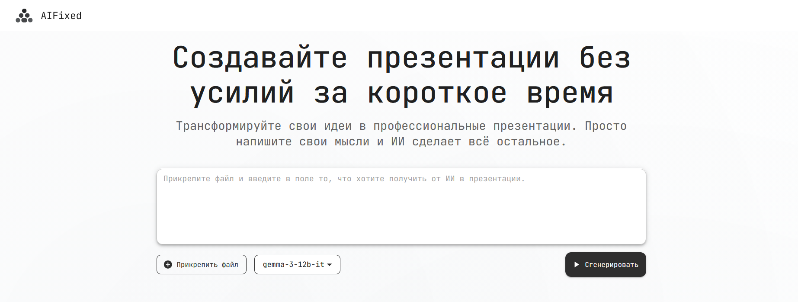
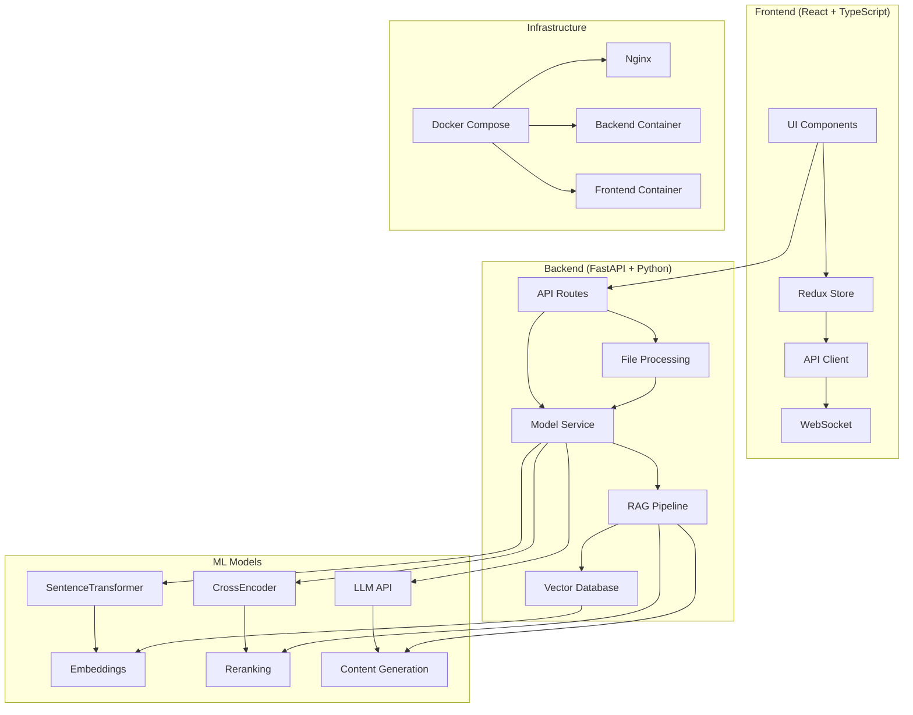

<div align="center">


**Интеллектуальная система генерации презентаций на основе ИИ с RAG-архитектурой**

[Быстрый старт](#-быстрый-старт) • [Архитектура](#️-архитектура) • [ML Модели](#-ml-модели) • [API](#-api)

</div>

---

## 📋 Оглавление

- [Описание проекта](#-описание-проекта)
- [Основные возможности](#-основные-возможности)
- [Архитектура](#️-архитектура)
- [ML Модели](#-ml-модели)
- [Быстрый старт](#-быстрый-старт)
- [Установка зависимостей](#-установка-зависимостей)
- [Конфигурация](#️-конфигурация)
- [Разработка](#-разработка)
- [Docker](#-docker)
- [API](#-api)
- [Frontend](#-frontend)
- [Backend](#-backend)
- [Структура проекта](#-структура-проекта)
- [Вклад в проект](#-вклад-в-проект)
- [Лицензия](#-лицензия)

---

## 🎯 Описание проекта

**AIFixed** — это полнофункциональная система для автоматической генерации презентаций с использованием искусственного интеллекта. Проект объединяет современные технологии машинного обучения, веб-разработки и обработки документов для создания интеллектуального инструмента создания презентаций.

### Ключевые особенности

- **ИИ-генерация контента** - Автоматическое создание слайдов на основе загруженных документов
- **RAG-архитектура** - Retrieval-Augmented Generation для точной работы с контекстом
- **Адаптивные темы** - Различные визуальные темы для разных типов аудитории
- **Интерактивное редактирование** - Возможность редактирования слайдов в реальном времени
- **Автоматическая визуализация** - Генерация диаграмм и графиков на основе данных
- **Современный UI** - React + Material-UI интерфейс с анимациями

---

## ✨ Основные возможности

### Генерация презентаций
- **Классификация аудитории** - Автоматическое определение типа аудитории (TopManagement, Experts, Investors)
- **Планирование структуры** - ИИ создает оптимальную структуру презентации
- **Контекстная генерация** - Использование загруженных документов для создания релевантного контента

### Редактирование слайдов
- **Множественные действия** - Polish, Correct, Translate, Expand, Shorten, Simplify, Specify
- **Пользовательские промпты** - Возможность задать собственные инструкции
- **Визуальное редактирование** - Drag & Drop интерфейс для перестановки блоков

### Визуализация данных
- **Автоматические диаграммы** - Генерация bar, line, pie charts на основе данных
- **Интерактивные графики** - Использование Chart.js для создания интерактивных элементов
- **Адаптивные темы** - Различные цветовые схемы и стили

---

## 🎥 Предпросмотр сервиса



---

## 🏗️ Архитектура



### Поток данных

1. **Загрузка документа** → Обработка файла → Извлечение текста
2. **Создание эмбеддингов** → Векторизация → Сохранение в Qdrant
3. **Пользовательский запрос** → Классификация аудитории → Планирование структуры
4. **Генерация контента** → RAG поиск → LLM генерация → Создание слайдов
5. **Редактирование** → Пользовательские действия → Регенерация контента

---

## 🤖 ML Модели

### Используемые модели

| Модель | Назначение | Размер | Производительность |
|--------|------------|--------|-------------------|
| **BAAI/bge-m3** | Embeddings для RAG | ~1.2GB | 1024 dim |
| **cross-encoder/ms-marco-MiniLM-L-6-v2** | Reranking результатов | ~80MB | Fast inference |
| **OpenRouter API** | LLM для генерации | Cloud | Various models |

### Конфигурация моделей

```python
# Настройки по умолчанию
DEFAULT_EMBEDDING_MODEL = "BAAI/bge-m3"
CROSS_ENCODER_MODEL = "cross-encoder/ms-marco-MiniLM-L-6-v2"
DEFAULT_MODEL = "moonshotai/kimi-k2-0905"  # OpenRouter
```

### Поддерживаемые LLM модели

- `moonshotai/kimi-k2-0905` - Основная модель
- `openai/gpt-oss-120b` - Альтернативная
- `google/gemma-3-12b-it` - Google Gemma

---

## 🚀 Быстрый старт

### Предварительные требования

- **Docker** и **Docker Compose**
- **Node.js** 18+ (для разработки)
- **Python** 3.11+ (для разработки)
- **Git**

### Запуск через Docker

```bash
# Клонирование репозитория
git clone https://github.com/aklyue/AIFixed.git
cd AIFixed

# Создание .env файлов
cp backend/.env.example backend/.env
cp frontend/.env.example frontend/.env

# Запуск всех сервисов
docker-compose up --build
```

### Доступ к приложению

- **Frontend**: http://188.120.241.192:3000
- **Backend API**: http://188.120.241.192:8000
- **API Documentation**: http://188.120.241.192:8000/docs

---

## 🗺 Роутинг

| Путь          | Компонент / Описание                  |
|---------------|--------------------------------------|
| `/`           | `PromptPage` — главная страница, знакомство с сервисом и отправка промпта |
| `/generate`   | `GeneratePage` — генерация контента на основе промпта |
| `/editor`     | `EditorPage` — редактор для доработки и сохранения сгенерированной презентации |
| `/auth`       | `AuthPage` - страница авторизации |
| `/settings`   | `SettingsPage` - настройки пользователя |
| `/projects` | `MyPresentationsPage` - список созданных презентаций (только для авторизованных пользователей) |
| `/verify-email` | `VerificationPage` - подтверждение кода при регистрации |
| `/auth/success` | `OAuthSuccess` - fallback-компонент успешной OAuth-авторизации |

Все страницы обернуты в компонент `PageWrapper` для единого оформления и управления макетом.

---

## 📦 Установка зависимостей

### Backend (Python)

```bash
cd backend

# Создание виртуального окружения
python -m venv venv
source venv/bin/activate  # Linux/Mac
# или
venv\Scripts\activate     # Windows

# Установка зависимостей
pip install -r requirements.txt
```

### Frontend (Node.js)

```bash
cd frontend

# Установка зависимостей
npm install

# Запуск в режиме разработки
npm start
```

---

## ⚙️ Конфигурация

### Переменные окружения

#### Backend (.env)
```env
# API Keys
OPENROUTER_API_KEY=your_openrouter_key
OPENAI_API_KEY=your_openai_key  # опционально

# Model Configuration
DEFAULT_MODEL=moonshotai/kimi-k2-0905
DEFAULT_EMBEDDING_MODEL=BAAI/bge-m3
CROSS_ENCODER_MODEL=cross-encoder/ms-marco-MiniLM-L-6-v2

# File Processing
TEMPFILE_DIR=./tempfiles
TEMPFILE_CLEANUP_INTERVAL_SECONDS=3600

# Environment
ENVIRONMENT=production

# PostgreSQL
POSTGRES_USER=postgres
POSTGRES_PASSWORD=password
POSTGRES_DB=yourdb
POSTGRES_HOST=localhost
POSTGRES_PORT=5432

# JWT
SECRET_KEY=your_secret_key
ALGORITHM=HS256

# SMTP
SMTP_HOST=smtp.gmail.com
SMTP_PORT=587
SMTP_USER=your_email@gmail.com
SMTP_PASSWORD=smtp_password
SMTP_FROM_EMAIL=your_email@gmail.com

# GitHub OAuth
GITHUB_CLIENT_ID=github_client_id
GITHUB_CLIENT_SECRET=github_client_secret_key
GITHUB_REDIRECT_URI=http://188.120.241.192:8000/auth/github/callback

# Google OAuth
GOOGLE_CLIENT_ID=google_client_id
GOOGLE_CLIENT_SECRET=google_client_secret_key
GOOGLE_REDIRECT_URI=http://188.120.241.192:8000/auth/google/callback
FRONT_URL=http://188.120.241.192:3000

```

#### Frontend (.env)
```env
REACT_APP_API_URL=http://188.120.241.192:8000/api
```

### Настройки модели

```python
# backend/src/config.py
class ModelSettings:
    MIN_SLIDES = 10
    MAX_SLIDES = 15
    TOP_K_RETRIEVAL = 5
    CHUNK_SIZE = 512
    CHUNK_OVERLAP = 50
    GEN_TEMPERATURE = 0.2
```

---

## 🔧 Разработка

### Локальная разработка

#### Backend
```bash
cd backend
python -m src.preload  # Предзагрузка моделей
uvicorn src.main:app --reload --host 0.0.0.0 --port 8000
```

#### Frontend
```bash
cd frontend
npm start
```

### Мониторинг

- **Логи**: Структурированные логи с уровнем INFO
- **Метрики**: Время генерации, использование памяти
- **Health Check**: `/api/health` endpoint

---

## 🐳 Docker

### Сборка образов

```bash
# Backend
docker build -t ai-presentation-backend ./backend

# Frontend
docker build -t ai-presentation-frontend ./frontend
```

### Docker Compose

```yaml
version: '3.8'
services:
  nginx:
    image: nginx:alpine
    ports: ["80:80", "443:443"]
    depends_on: [backend, frontend]
  
  frontend:
    build: ./frontend
    environment:
      - NODE_ENV=production
  
  backend:
    build: ./backend
    environment:
      - ENVIRONMENT=production
    volumes:
      - models_cache:/models_cache
```

### Volumes

- `models_cache` - Кэш для ML моделей
- `tempfiles` - Временные файлы
- `certbot` - SSL сертификаты

---

## 📊 API

### Основные эндпоинты

#### Презентация
```http
"Генерация презентации"

POST /api/presentation/generate
Content-Type: multipart/form-data

text: "Описание презентации"
file: [uploaded file]
model: "moonshotai/kimi-k2-0905"
```

```http
"Получение презентаций (для авторизованных пользователей)"

GET /api/presentation/my-presentations
```

```http
"Сохранение презентации (для авторизованных пользователей)"

POST /api/presentation/save-presentation
```

```http
"Удаление презентации (для авторизованных пользователей)"

DELETE /api/presentation/{presentation_id}
```

```http
"Редактирование презентации"

POST /api/presentation/edit
```

#### Получение файла
```http
GET /api/files/{filename}
```

#### Авторизация пользователя
```http
POST /api/auth/register

POST /api/auth/login

GET /api/auth/me
```

#### Верификация
```http
POST /api/auth/email/send_code

POST /api/auth/email/verify
```

#### OAuth 2.0
```https
GET /api/auth/github/login
GET /api/auth/github/callback

GET /api/auth/google/login
GET /api/auth/google/callback
```

#### Настройки пользователя
```http
PUT /api/user/edit
```

#### Подробное описание маршрутов
```http
http://188.120.241.192:8000/docs
```

### Схемы данных

#### GeneratePresInSchema
```python
{
  "text": str,      # Описание презентации
  "model": str      # Модель LLM
}
```

#### EditSlideInSchema
```python
{
  "text": str,      # Новый текст
  "slide": dict,    # Данные слайда
  "action": str,    # Действие (polish, correct, etc.)
  "model": str      # Модель LLM
}
```

---

## 🎨 Frontend

### Архитектура (Feature-Sliced Design)

```
    src                                // Исходный код всего приложения
    ├── app
    │   └── store                      // Redux store приложения
    │       └── slices                 // Redux-slices по доменным сущностям
    │           └── reducers/actions — управление состоянием
    │
    ├── entities                    // Доменные сущности
    │   // Содержит всё, что относится к конкретным моделям данных: API, UI-компоненты и хуки
    │   ├── auth                    // Авторизация и аутентификация
    │   │   ├── api                 // Запросы к бэкенду по авторизации
    │   │   └── model
    │   ├── github                  // Интеграция с GitHub
    │   │   └── api                 // API-запросы к GitHub
    │   ├── presentation            // Сущность "Презентация"
    │   │   ├── api                 // API для работы с презентациями
    │   │   └── ui                  // UI-компоненты для работы с презентациями
    │   │       └── MyPresentations // Компоненты для отображения списка презентаций пользователя
    │   └── user                    // Сущность "Пользователь"
    │       ├── api                 // API-запросы для получения/обновления данных пользователя
    │       ├── model
    │       └── ui
    │           ├── components
    │           │   └── SettingsForm // Компонент формы настроек пользователя
    │           └── hooks
    │               └── useSettings  // Кастомный хук логики настроек
    │
    ├── features                       // Фичи (завершённые пользовательские сценарии)
    │   ├── auth
    │   │   ├── blocks
    │   │   │   ├── components
    │   │   │   │   ├── LoginBlock
    │   │   │   │   ├── RegistrationBlock
    │   │   │   │   └── VerificationBlock
    │   │   │   └── hooks
    │   │   │       └── useVerify    // Хук для подтверждения email
    │   │   └── ui
    │   │       └── hooks
    │   │           ├── useAuth      // Хук для логики авторизации
    │   │           └── useTabsChange // Хук для переключения вкладок
    │   ├── landing                    // Главная страница сайта
    │   │   ├── blocks                 // Отдельные секции landing page
    │   │   │   ├── FeaturesBlock
    │   │   │   ├── HowItWorksBlock
    │   │   │   ├── QuickStartBlock
    │   │   │   └── WhyUsBlock
    │   │   ├── lib
    │   │   │   └── constants          // Константы для landing page
    │   │   └── ui                     // UI-компоненты главной страницы
    │   │
    │   ├── navigation               // Навигация приложения
    │   │   └── ui
    │   │       └── components
    │   │           └── ProtectedRoute // Компонент маршрута с проверкой авторизации
    │   │
    │   ├── presentation               // Большая фича редактора презентаций
    │   │   ├── blocks                 // Блоки слайдов
    │   │   │   ├── AiChat             // AI-чат для редактирования презентации
    │   │   │   │   └── ui             // UI комопненты для AI-чаиа
    │   │   │   ├── RenderBlock
    │   │   │   │   ├── components     // Компоненты рендера каждого блока слайда
    │   │   │   │   │   ├── ChartBlock
    │   │   │   │   │   ├── ChartBlockWrapper
    │   │   │   │   │   ├── ChartEditor
    │   │   │   │   │   ├── CodeBlock
    │   │   │   │   │   ├── EditableWrapper
    │   │   │   │   │   ├── HeadingBlock
    │   │   │   │   │   ├── ListBlock
    │   │   │   │   │   ├── ParagraphBlock
    │   │   │   │   │   ├── QuoteBlock
    │   │   │   │   │   ├── TableBlockWrapper
    │   │   │   │   │   ├── TableEditor
    │   │   │   │   │   └── TextEditor
    │   │   │   │   ├── hooks          // Логика редактирования блоков
    │   │   │   │   │   ├── useChartEditor
    │   │   │   │   │   ├── useChartWrapper
    │   │   │   │   │   ├── useEditableWrapper
    │   │   │   │   │   ├── useTableEditor
    │   │   │   │   │   ├── useTableWrapper
    │   │   │   │   │   └── useTextBlocksEditor
    │   │   │   │   └── lib
    │   │   │   │       └── utils      // Утилиты блока
    │   │   │   ├── SlideContent        // Лэйауты для компоновки элементов слайда
    │   │   │   │   ├── components
    │   │   │   │   │   ├── Grid2x2Layout
    │   │   │   │   │   ├── GridTextTopTwoBottomLayout
    │   │   │   │   │   ├── ImageColumnLayout
    │   │   │   │   │   ├── ImageRowLayout
    │   │   │   │   │   └── ResizableImage
    │   │   │   │   │       └── EditableImage
    │   │   │   │   └── hooks
    │   │   │   │       ├── useEditableImage
    │   │   │   │       └── useResizeImage
    │   │   │   └── SortableBlock       // DnD блоки внутри слайда
    │   │   ├── hooks
    │   │   │   ├── useSlideScroll      // Скролл в редакторе
    │   │   │   └── useSortableBlock    // Перетаскивание блоков
    │   │   ├── lib
    │   │   │   ├── constants           // Константы редактора
    │   │   │   ├── utils               // Утилиты редактора
    │   │   │   └── types               // Типы блока/слайда
    │   │   └── ui                      // UI редактора презентаций
    │   │       ├── components
    │   │       │   ├── AddSlideDialog
    │   │       │   ├── EditSlideDialog
    │   │       │   ├── EmptyState
    │   │       │   ├── MiniSlides
    │   │       │   ├── SlideEditPrompt
    │   │       │   ├── SlideItem
    │   │       │   ├── SlideList
    │   │       │   ├── SlideNavigationToolbar
    │   │       │   ├── SlideToolbar
    │   │       │   └── ThemeSelector
    │   │       ├── hooks
    │   │       │   ├── useBlockActions
    │   │       │   ├── useIconsReveal
    │   │       │   ├── useMiniSlidesActions
    │   │       │   ├── useSlideActions
    │   │       │   └── useSlideApiAction
    │   │       └── lib
    │   │           ├── constants
    │   │           └── utils
    │   │
    │   └── setupSlides                 // Экран первичного формирования слайдов (после генерации)
    │       ├── blocks
    │       │   └── RenderBlock
    │       │       ├── components
    │       │       │   └── RenderBlock
    │       │       └── hooks
    │       │           └── useRenderBlock
    │       └── ui
    │           ├── components
    │           │   ├── SlidesList
    │           │   ├── SortableSlide
    │           │   └── ThemeCardSelector
    │           └── hooks
    │               ├── useSlidesList
    │               └── useSortableSlide
    │
    ├── pages                        // Страницы приложения (роуты)
    │   ├── AuthPage
    │   ├── EditorPage
    │   ├── GeneratePage
    │   ├── MyPresentationsPage
    │   ├── PromptPage
    │   ├── SettingsPage
    │   └── VerificationPage
    │
    ├── shared                          // Переиспользуемый код (shared kernel)
    │   ├── assets                      // Изображения, иконки, статические файлы
    │   ├── components                  // Общие UI-компоненты (например, Loader, OAuthSuccess)
    │   ├── constants                   // Глобальные константы приложения
    │   ├── hooks                       // Переиспользуемые хуки
    │   ├── types                       // Глобальные TS-типы
    │   └── utils                       // Вспомогательные функции
    │
    └── widgets                      // Готовые UI-составные блоки (Header, Footer)
        ├── Footer
        │   ├── blocks
        │   │   ├── components
        │   │   └── hooks
        │   └── ui
        └── Header
            ├── blocks
            │   ├── components
            │   └── hooks
            ├── hooks
            └── ui
```

### Технологии

- **React 19.2.0** - Основной фреймворк
- **TypeScript** - Типизация
- **Dnd-Kit** - Перетаскивание слайдов/блоков
- **Material-UI** - UI компоненты
- **Redux Toolkit** - Управление состоянием
- **Framer Motion** - Анимации
- **Chart.js** - Графики и диаграммы
- **React Router** - Маршрутизация

### Темы и стилизация

```typescript
interface Theme {
  id: string;
  name: string;
  colors: {
    background: string;
    heading: string;
    paragraph: string;
    backgroundImages?: string[];
  };
  fonts: {
    heading: string;
    paragraph: string;
  };
}
```

---

## 🔧 Backend

### Архитектура

```
src/
├── main.py              # FastAPI приложение
├── config.py            # Конфигурация
├── preload.py           # Предзагрузка моделей
├── modules/             # Основные модули
│   └── models/          # ML модели и RAG
├── routes/              # API маршруты
├── services/            # Бизнес-логика
├── schemas/             # Pydantic схемы
└── utils/               # Утилиты
```

### RAG Pipeline

1. **Document Processing** - Обработка загруженных файлов
2. **Chunking** - Разбиение на фрагменты (512 токенов)
3. **Embedding** - Создание векторных представлений
4. **Storage** - Сохранение в Qdrant
5. **Retrieval** - Поиск релевантных фрагментов
6. **Reranking** - Переранжирование с CrossEncoder
7. **Generation** - Создание контента с LLM

### Обработка файлов

Поддерживаемые форматы:
- **PDF** - pdfplumber, PyMuPDF
- **DOCX** - python-docx
- **PPTX** - python-pptx
- **TXT** - Прямая обработка
- **Markdown** - docx2md

---

## 📁 Структура проекта

```
AH-git/
├── 📁 backend/                # Python FastAPI backend
│   ├── 📁 src/                # Исходный код
│   │   ├── 📁 modules/        # ML модули
│   │   ├── 📁 routes/         # API маршруты
│   │   ├── 📁 services/       # Бизнес-логика
│   │   └── 📁 schemas/        # Pydantic схемы
│   ├── 📁 local_models/       # Локальные ML модели
│   ├── 📁 tempfiles/          # Временные файлы
│   ├── 📄 Dockerfile          # Docker образ
│   └── 📄 requirements.txt    # Python зависимости
├── 📁 frontend/               # React TypeScript frontend
│   ├── 📁 src/                # Исходный код
        ├── 📁 app/            # Входная точка приложения
│   │   ├── 📁 entities/       # Сущности
│   │   ├── 📁 features/       # Основные фичи
│   │   ├── 📁 pages/          # Страницы
│   │   ├── 📁 shared/         # Общие компоненты
│   │   └── 📁 widgets/        # Переиспользуемые виджеты
│   ├── 📄 Dockerfile          # Docker образ
│   └── 📄 package.json        # Node.js зависимости
├── 📁 nginx/                  # Nginx конфигурация
├── 📁 certbot/                # SSL сертификаты
├── 📄 docker-compose.yml      # Docker Compose
└── 📄 README.md               # Документация
```

---

## 🤝 Вклад в проект

### Настройка для разработки

1. **Fork** репозитория
2. **Clone** вашей копии
3. Создайте **feature branch**
4. Внесите изменения
5. Создайте **Pull Request**

### Стандарты кода

- **Python**: PEP 8, Black formatter
- **TypeScript**: ESLint, Prettier
- **Commits**: Conventional Commits
- **Tests**: Покрытие > 80%

### Сообщение об ошибках

Используйте GitHub Issues с шаблоном:
- Описание проблемы
- Шаги воспроизведения
- Ожидаемое поведение
- Логи и скриншоты

---

## 📄 Лицензия

Этот проект распространяется под лицензией **MIT**. См. файл [LICENSE](LICENSE) для подробностей.

---

<div align="center">

**Создано с ❤️ для автоматизации создания презентаций**

[🔗 GitHub](https://github.com/aklyue/AIFixed) • [📦 Releases](https://github.com/aklyue/AIFixed/releases) • [📧 Email](mailto:olegglapshin@gmail.com) • [🐛 Issues](https://github.com/aklyue/AIFixed/issues)

</div>
